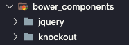
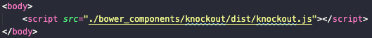
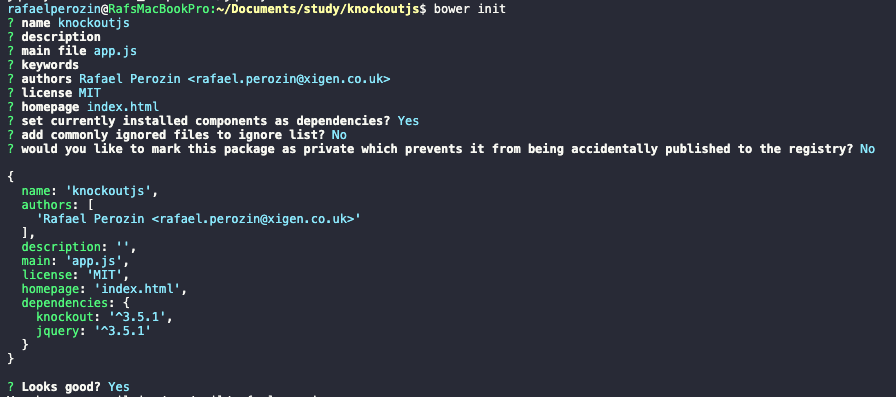

# KnockoutJS Course

When using [Knockout JS](https://knockoutjs.com/documentation/introduction.html) we usually make ajax call to read and write the model data.

## Install using command line:
1. ```$ npm install bower -g```
2. Create a folder of you project and use cd to navigate there
3. ```$ bower install knockout```
4. So you will have a bower_components folder with libraries you’ve installed

  

5. You can import into your JS using import or require (depend of you stack)OR you can add a script in your html like this

  

6. $ bower initThis command will generate a bower.json file.

  

## You can use…
- `ko.applyBings` to pass the values to the HTML
- `ko.observables` to make the object value writable
- `ko.computed` to return a function return to the HTMLYou can use read and write functions to show the full name when called on HTML and write to allow the function to change the values inside the object.

## To check and get boolean value as return you can use:
- `ko.isComputed(property)`
- `ko.isObservable(property)` returns true for observables, observableArrays, and computed observables.
- `ko.isWritableObservable(property)`: returns true for observables, observableArrays, and writable computed observables.

**Observable Arrays** you can use with any native JS array functions, but it’s better to use the equivalent functions of KO because it works on all targeted browsers.

## Observable Arrays properties and methods:
- indexOf
- Splice: get a peace of the array
- Pop: remove
- Push: add
- Shift: 
- Unshift
- Reverse
- Sort

## Preventing the event from bubbling
By default, Knockout will allow the click event to continue to bubble up to any higher level event handlers. For example, if your element and a parent of that element are both handling the click event, then the click handler for both elements will be triggered. If necessary, you can prevent the event from bubbling by including an additional binding that is named clickBubble and passing false to it, as in this example:

```html
<div data-bind="click: myDivHandler">
    <button data-bind="click: myButtonHandler, clickBubble: false">Click me</button>
</div>
```

Normally, in this case myButtonHandler would be called first, then the click event would bubble up to myDivHandler. However, the clickBubble binding that we added with a value of false prevents the event from making it past myButtonHandler.

## Binding Context
Have a look on the example at `11_binding-context` lesson
- `$data` -> each element in the array, on this example, it's each month
- `$parent` -> the parent of current object, on this example, the parent of months is viewModel
- `$index` -> position of each array element, on this example, position of each month on the array)
- `$root` -> viewModel
